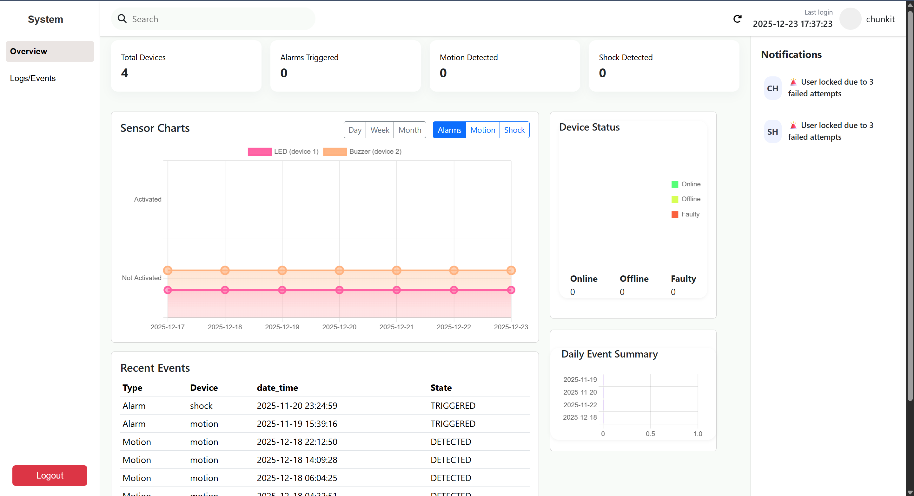
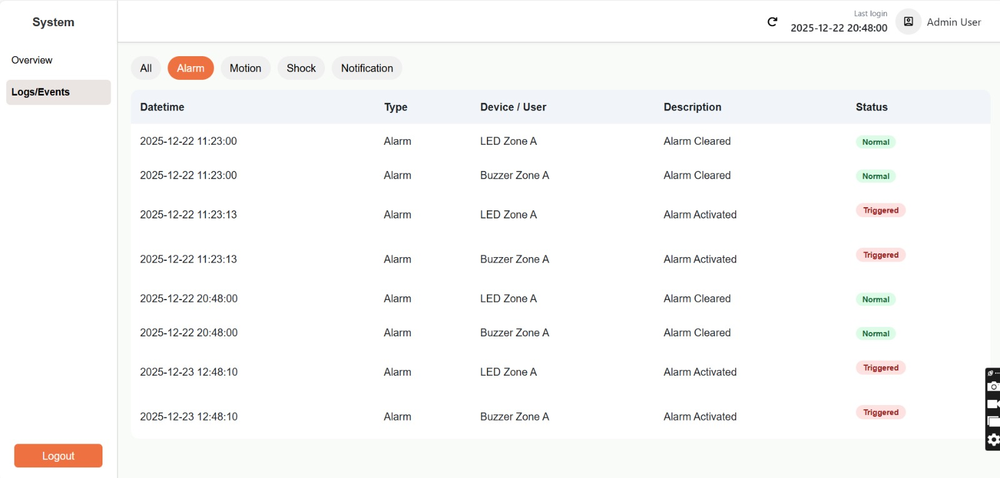
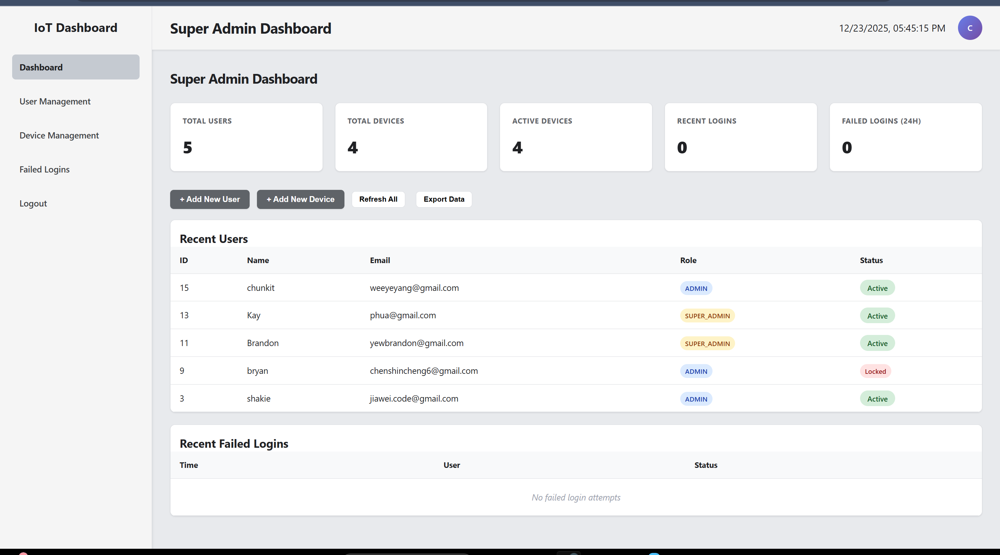
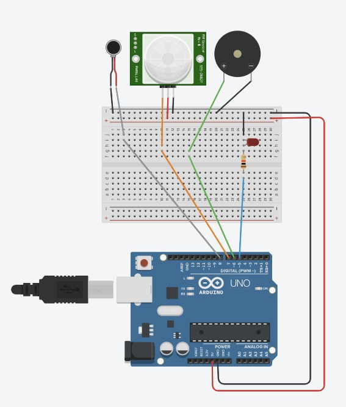

# 🔐 Arduino-Based Intruder Detection System 

A **low-cost intruder detection system** using an **Arduino Uno** for motion and shock sensing, with a **PHP-based web dashboard hosted on AWS EC2** for monitoring, logging, and control.

---

## 1. Project Overview and Motivation

### Problem Statement
Most commercial security systems are **expensive**, **cloud-dependent**, and can fail during network outages, leaving premises vulnerable.

### Proposed Solution
AF-IDS provides a **cost-effective, decentralized solution**. The Arduino node detects **motion (PIR)** and **physical tampering (shock sensor)**, while a **PHP dashboard on AWS EC2** allows real-time monitoring, historical logs, and alarm control without cloud subscriptions.

**Key Objectives:**
1. Build Arduino sensor node for motion and shock detection.
2. Deploy PHP-based web dashboard for monitoring and control.
3. Implement security measures including authentication, password hashing, and intrusion detection.

---

## 2. Complete System Architecture

The system uses a **client–server architecture**:

- **Arduino Edge Node**: Reads sensors, triggers alarms, sends events via HTTP.
- **AWS EC2 Server**: Hosts PHP backend and MySQL database.
- **Admin Dashboard**: Displays events, alerts, logs, and controls alarms.

**System Diagram:**

---

## 3. Hardware and Software Setup

### Hardware Components
| Component | Purpose |
|-----------|--------|

| Arduino Uno | Main controller | 
| PIR Motion Sensor | Motion detection |
| Shock Sensor | Detect physical tampering |
| Buzzer | Audible alert |
| LED | Visual alert |
| Wi-Fi Shield | Network communication |

### Software
| Software | Purpose |
|----------|--------| 
| Arduino IDE | Firmware development |
| PHP | Backend & web dashboard |
| HTML / CSS / JavaScript | Dashboard UI |
| MySQL  Event and user data storage |
| Apache / Nginx | Web server on AWS EC2 |
| bcrypt | Password hashing |

---

## 4. Networking Protocol Design

- **Protocol:** HTTP REST API
- **Communication:** Arduino nodes → server for event upload; server → nodes for alarm control
- **Topology:** Multiple Arduino nodes → single centralized AWS EC2 server

---

## 5. Security Implementation

- **Authentication:** Passwords hashed using PHP `password_hash()` (bcrypt)
- **Session Management:** Server-side sessions with regenerated session IDs
- **Intrusion Detection:** Accounts locked after 3 failed login attempts; alerts displayed on the dashboard
- **Local Alarms:** Immediate response to sensor triggers (buzzer/LED/relay)

---

## 6. Testing Evidence and Results

- **Test 1:** PIR motion detection
  - Triggered alarm and logged event successfully
- **Test 2:** Shock sensor detection
  - Triggered alarm and logged event successfully
- **Test 3:** Failed login attempt handling
  - Account locked after 3 failed attempts; alert displayed

**Results:**
- Real-time detection is functional
- Logs are accurately stored in the database
- Admin dashboard displays events correctly

---

## 7. Screenshots, Logs, and Diagrams
**Login Page Screenshot:**  

**Admin Dashboard Screenshot:**  

**Event Log Example:**  

**SuperAdmin Page Screenshot:**  

**Hardware Setup Diagram:**  

---

## 8. Future Improvements

- Add **mobile-friendly dashboard**
- Enable **push notifications (SMS/Email)**
- Introduce **role-based access control (RBAC)**
- Support **MQTT protocol** for multiple node scalability

---

## 9. Course Information

**Course:** NET3054  
**Submission:** December 2025
