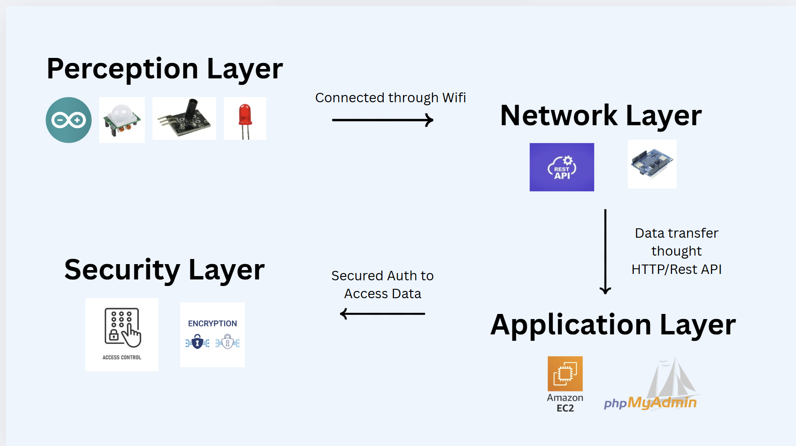

# 🔐 Arduino-Based Intruder Detection System (AF-IDS)

A **low-cost intruder detection system** using an **Arduino Uno** for motion and shock sensing, with a **PHP-based web dashboard hosted on AWS EC2** for monitoring, logging, and control.

---

## 1. Project Overview & Motivation

### Problem Statement
Commercial security systems are often **expensive** and **cloud-dependent**, making them unsuitable for small businesses and homes. They can fail during internet outages, leaving premises unprotected.

### Proposed Solution
AF-IDS provides a **cost-effective, decentralized solution**. The Arduino edge node detects motion and tampering locally, while a PHP-based dashboard hosted on AWS EC2 allows **real-time monitoring, logging, and control** without relying on paid cloud subscriptions.

---

## 2. Project Objectives

1. Develop an Arduino node to detect **motion (PIR)** and **physical impact (shock sensors)**.
2. Create a **PHP-based admin dashboard** for monitoring, historical logs, and alarm control.
3. Implement **basic security measures**, including authentication, password hashing, and intrusion detection.

---

## 3. System Architecture

- **Arduino Edge Node**: Reads sensor data, triggers local alarms (buzzer, LED, relay), sends events to server.
- **AWS EC2 Server**: Hosts PHP backend and MySQL database, manages the dashboard.
- **Admin Dashboard**: Displays real-time events, alerts, and allows remote alarm control.

---

## 4. Hardware & Software

### Hardware
- Arduino Uno (ATmega328P)
- PIR Motion Sensor
- Shock Sensor
- 5V Relay Module
- Buzzer & LED
- ESP8266 / Wi-Fi Shield
- Power Supply (5–12V)

### Software
- Arduino IDE
- PHP (backend & dashboard)
- HTML / CSS / JavaScript
- MySQL
- Apache / Nginx (AWS EC2)
- bcrypt (password hashing)

---

## 5. Security Implementation

- **Authentication**: Passwords hashed with PHP `password_hash()` (bcrypt)
- **Session Management**: Server-side sessions with regenerated session IDs
- **Intrusion Detection**: Multiple failed login attempts trigger account lockout, alerts displayed on dashboard

---

## 6. Expected Outcomes

- Real-time detection of motion and tampering
- Immediate local alarms (sound and light)
- Secure web-based monitoring dashboard
- Historical event logs
- Cost-effective alternative to cloud-based systems

---

## 7. Future Improvements

- HTTPS for secure connections
- Mobile-friendly dashboard
- Push notifications for alerts
- Role-based access control

---

## 8. Course Information

**Course:** NET3054  
**Group:** Group 10  
**Submission:** September 2025
